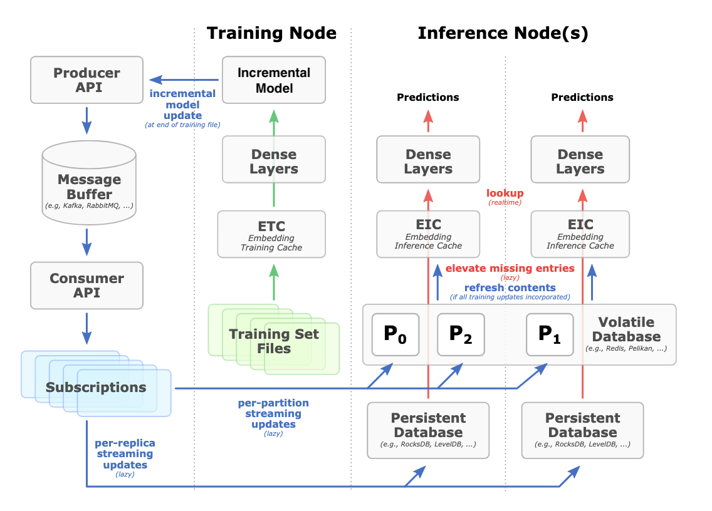

<!--
# Copyright (c) 2020, NVIDIA CORPORATION. All rights reserved.
#
# Redistribution and use in source and binary forms, with or without
# modification, are permitted provided that the following conditions
# are met:
#  * Redistributions of source code must retain the above copyright
#    notice, this list of conditions and the following disclaimer.
#  * Redistributions in binary form must reproduce the above copyright
#    notice, this list of conditions and the following disclaimer in the
#    documentation and/or other materials provided with the distribution.
#  * Neither the name of NVIDIA CORPORATION nor the names of its
#    contributors may be used to endorse or promote products derived
#    from this software without specific prior written permission.
#
# THIS SOFTWARE IS PROVIDED BY THE COPYRIGHT HOLDERS ``AS IS'' AND ANY
# EXPRESS OR IMPLIED WARRANTIES, INCLUDING, BUT NOT LIMITED TO, THE
# IMPLIED WARRANTIES OF MERCHANTABILITY AND FITNESS FOR A PARTICULAR
# PURPOSE ARE DISCLAIMED.  IN NO EVENT SHALL THE COPYRIGHT OWNER OR
# CONTRIBUTORS BE LIABLE FOR ANY DIRECT, INDIRECT, INCIDENTAL, SPECIAL,
# EXEMPLARY, OR CONSEQUENTIAL DAMAGES (INCLUDING, BUT NOT LIMITED TO,
# PROCUREMENT OF SUBSTITUTE GOODS OR SERVICES; LOSS OF USE, DATA, OR
# PROFITS; OR BUSINESS INTERRUPTION) HOWEVER CAUSED AND ON ANY THEORY
# OF LIABILITY, WHETHER IN CONTRACT, STRICT LIABILITY, OR TORT
# (INCLUDING NEGLIGENCE OR OTHERWISE) ARISING IN ANY WAY OUT OF THE USE
# OF THIS SOFTWARE, EVEN IF ADVISED OF THE POSSIBILITY OF SUCH DAMAGE.
-->

[](https://opensource.org/licenses/BSD-3-Clause)

# Hierarchical Parameter Server Backend
The Hierarchical Parameter Server(HPS) Backend is a framework for embedding vectors looking up on large-scale embedding tables that was designed to effectively use GPU memory to accelerate the looking up by decoupling the embedding tables and embedding cache from the end-to-end inference pipeline of the deep recommendation model. The HPS Backend supports  executing multiple embedding vector looking-up services concurrently across multiple GPUs by embedding cache that is shared between multiple look_up sessions. For more information, see [Hierarchical Parameter Server Architecture](docs/architecture.md#hps-backend-framework).  

## Quick Start
You can build the HPS Backend from scratch and install to the specify path based on your own specific requirements using the NGC Merlin inference Docker images.

We support the following compute capabilities for inference deployment:

| Compute Capability | GPU                  | [SM](#building-hugectr-from-scratch) |
|--------------------|----------------------|----|
| 7.0                | NVIDIA V100 (Volta)  | 70 |
| 7.5                | NVIDIA T4 (Turing)   | 75 |
| 8.0                | NVIDIA A100 (Ampere) | 80 |
| 8.6                | NVIDIA A10 (Ampere)  | 72 |

The following prerequisites must be met before installing or building the HugeCTR Backend from scratch:
* Docker version 19 and higher
* cuBLAS version 10.1
* CMake version 3.17.0
* cuDNN version 7.5
* RMM version 0.16
* GCC version 7.4.0

### Install the HPS Backend Using NGC Containers
All NVIDIA Merlin components are available as open-source projects. However, a more convenient way to make use of these components is by using Merlin NGC containers. These NGC containers allow you to package your software application, libraries, dependencies, and runtime compilers in a self-contained environment. When installing the HPS Backend using NGC containers, the application environment remains both portable, consistent, reproducible, and agnostic to the underlying host system software configuration. The HPS Backend container has the necessary libraries and header files pre-installed, and you can directly deploy the HPS models to production.

Docker images for the HPS Backend are available in the NVIDIA container repository on https://catalog.ngc.nvidia.com/orgs/nvidia/teams/merlin/containers/merlin-hugectr. You can pull and launch the container by running the following command:
```
docker run --gpus=1 --rm -it nvcr.io/nvidia/merlin/merlin-hugectr:23.09 # Start interaction mode  
```

**NOTE**: The HPS backend is derived from the HugeCTR backend. As of HugeCTR version 3.0, the HugeCTR container is no longer being released separately. If you're an advanced user, you should use the unified Merlin container to build the HugeCTR Training or Inference Docker image from scratch based on your own specific requirements. You can obtain the unified Merlin container by logging into NGC or by going [here](https://github.com/NVIDIA-Merlin/Merlin/blob/main/docker/dockerfile.ctr). 

### Build the HPS Backend from Scratch
Before building the HPS inference backend from scratch, you must first verify that the HugeCTR inference shared library (libhuge_ctr_inference.so) has been compiled. Then you can generate a HPS shared library (libtriton_hps.so), and copy to the HugeCTR/HPS default path to complete the backend building. The default path where all the HugeCTR and HPS Backend libraries and header files are installed in is `/usr/local/hugectr`. 

1. Building HugeCTR inference shared libarary from scratch, you should download the HugeCTR repository and the third-party modules that it relies on by running the following commands:
    ```
    $ git clone https://github.com/NVIDIA/HugeCTR.git
    # cd HugeCTR
    $ git submodule update --init --recursive
    ```
    Build HugeCTR inference backend
    ```
    $ mkdir -p build && cd build
    $ cmake -DCMAKE_BUILD_TYPE=Release -DSM="70;80" -DENABLE_INFERENCE=ON ..
    $ make -j && make install
    ```
    For more information, see [Build HPS from Source](https://nvidia-merlin.github.io/HugeCTR/main/hugectr_contributor_guide.html#build-hugectr-inference-container-from-source).
    After compiling, you can find the `libhuge_ctr_hps.so` file in the path `/usr/local/hugectr/lib`.

2. Buidling HPS inference backend. Download the HPS Backend repository by running the following commands:
   ```
   $ git https://github.com/triton-inference-server/hugectr_backend.git
   $ cd hugectr_backend/hps_backend
   ```
   Use CMAKE to build and install the HPS Backend as follows:
   ```
   $ mkdir -p build && cd build
   $ cmake -DCMAKE_INSTALL_PREFIX:PATH=`pwd`/install -DTRITON_COMMON_REPO_TAG=<rxx.yy>  -DTRITON_CORE_REPO_TAG=<rxx.yy> -DTRITON_BACKEND_REPO_TAG=<rxx.yy> ..
   $ make install
   $ ls             # check your compiled shared library(libtriton_hps.so)
   ```
   **NOTE**: Where <rxx.yy> is the "release version" of Triton that you want to deploy, like `r23.06`. You can use `tritonserver` command to confirm your current "server_version", and find the corresponding "release version" according to the "server_version" in [triton release note](https://github.com/triton-inference-server/server/releases). For example, `r23.06` corresponding to 2.20.0 Triton "server_version".
    | Option         | Value  |
    |----------------|--------|
    | server_id      | triton |
    | server_version | 2.35.0 |
    | release version| r23.06 |

3. Copy the compiled shared library(libtriton_hps.so) to your specified HPS default path.
   Please remember to specify the absolute path of the local directory that installs the HPS Backend for the `--backend-directory` argument when launching the Triton server.
   For example, copy to `/usr/local/hugectr/backends/hps` folder, and the sample command to start tritonserver would be
   ```
   $ tritonserver --model-repository=/path/to/model_repo/ --load-model=model_name \
    --model-control-mode=explicit \
    --backend-directory=/usr/local/hugectr/backends \
    --backend-config=hps,ps=/path/to/model_repo/hps.json
   ```
   
   The following Triton repositories, which are required, will be pulled and used in the build. By default, the "main" branch/tag will be used for each repository. However, the 
   following cmake arguments can be used to override the "main" branch/tag:
   * triton-inference-server/backend: -DTRITON_BACKEND_REPO_TAG=[tag]
   * triton-inference-server/core: -DTRITON_CORE_REPO_TAG=[tag]
   * triton-inference-server/common: -DTRITON_COMMON_REPO_TAG=[tag]

   For more reference, see [Triton example backends](https://github.com/triton-inference-server/backend/blob/main/examples/README.md) and [Triton backend shared library](https://github.com/triton-inference-server/backend#backend-shared-library).
  
## Independent Inference Hierarchical Parameter Server Configuration
The HPS backend configuration file is basically the same as HugeCTR inference Parameter Server related configuration format, and some new configuration items are added for the HPS backend. Especially for the configuration of multiple embedded tables per model, avoid too many command parameters and reasonable memory pre-allocation when launching the Triton server.

In order to deploy the embedding table on HPS Backend, some customized configuration items need to be added as follows.
The configuration file of HPS Backend should be formatted using the JSON format.  

**NOTE**: The Models clause needs to be included as a list, the specific configuration of each model as an item. **sparse_file** can be filled with multiple embedding table paths to support multiple embedding tables per model.    

```json.
{
    "supportlonglong": true,
    "volatile_db": {
        "type": "hash_map",
        "user_name": "default",
        "num_partitions": 8,
        "max_batch_size": 100000,
        "overflow_policy": "evict_random",
        "overflow_margin": 10000000,
        "overflow_resolution_target": 0.8,
        "initial_cache_rate": 1.0
    },
    "persistent_db": {
        "type": "disabled"
    },
    "models": [{
        "model": "hps_wdl",
        "sparse_files": ["/hps_infer/embedding/hps_wdl/1/wdl0_sparse_2000.model", "/hps_infer/embedding/hps_wdl/1/wdl1_sparse_2000.model"],
        "num_of_worker_buffer_in_pool": 3,
        "embedding_table_names":["embedding_table1","embedding_table2"],
        "embedding_vecsize_per_table":[1,16],
        "maxnum_catfeature_query_per_table_per_sample":[2,26],
        "default_value_for_each_table":[0.0,0.0],
        "deployed_device_list":[0],
        "max_batch_size":1024,
        "hit_rate_threshold":0.9,
        "gpucacheper":0.5,
        "gpucache":true
        }
    ]
}
```

## Model Repository Extension
Since the HPS Backend is a customizable Triton component, it is capable of supporting the Model Repository Extension. Triton's Model Repository Extension allows you to query and control model repositories that are being served by Triton. The “model_repository” is reported in the Extensions field of its server metadata. For more information, see [Model Repository Extension](https://github.com/triton-inference-server/server/blob/master/docs/protocol/extension_model_repository.md).  

The HPS Backend is fully compatible with the [Model Control EXPLICIT Mode](https://github.com/triton-inference-server/server/blob/main/docs/user_guide/model_management.md#model-control-mode-explicit) of Triton. Adding the configuration of a new model to the HPS configuration file. The HPS Backend has supported online deployment of new models by [the load API](https://github.com/triton-inference-server/server/blob/master/docs/protocol/extension_model_repository.md#load) of Triton. The old models can also be recycled online by [the unload API](https://github.com/triton-inference-server/server/blob/master/docs/protocol/extension_model_repository.md#unload).

The following should be noted when using Model Repository Extension functions:  
 - Depoly new models online: [The load API](https://github.com/triton-inference-server/server/blob/master/docs/protocol/extension_model_repository.md#load) will load not only the network dense weight as part of the HugeCTR model, but inserting the embedding table of new models to Hierarchical Inference Parameter Server and creating the embedding cache based on model definition in [Independent Parameter Server Configuration](#independent-inference-hierarchical-parameter-server-configuration), which means the Parameter server will independently provide an initialization mechanism for the new embedding table and embedding cache of new models.  
 
**Note:** If using the [HPS Inference Online Update](#hierarchical-parameter-server-online-update), in order to avoid the embedding table from being updated repeatedly by adding the *freeze_sparse*(false is default ) update option in the Triton configuration file (config.pbtxt).

 ```
 parameters:[
    ...
  {
  key: "freeze_sparse"
  value: { string_value: "true" }
  }
    ...
]
 ```

## Metrix
 Triton provides Prometheus metrics indicating GPU and request statistics. Use Prometheus to gather metrics into usable, actionable entries, giving you the data you need to manage alerts and performance information in your environment. Prometheus is usually used along side Grafana. Grafana is a visualization tool that pulls Prometheus metrics and makes it easier to monitor. You can build your own metrix system based on our example, see [HPS Backend Metrics](docs/metrics.md).  

 
## HPS Inference Hierarchical Parameter Server 
HPS Inference Hierarchical Parameter Server implemented a hierarchical storage mechanism between local SSDs and CPU memory, which breaks the convention that the embedding table must be stored in local CPU memory. `volatile_db Database` layer allows utilizing Redis cluster deployments, to store and retrieve embeddings in/from the RAM memory available in your cluster. The `Persistent Database` layer links HPS with a persistent database. Each node that has such a persistent storage layer configured retains a separate copy of all embeddings in its locally available non-volatile memory. see [Distributed Deployment](docs/architecture.md#distributed-deployment-with-hierarchical-hugectr-parameter-server) and [ Hierarchical Parameter Server](docs/hierarchical_parameter_server.md) for more details.

In the following table, we provide an overview of the typical properties different parameter database layers (and the embedding cache). We emphasize that this table is just intended to provide a rough orientation. Properties of actual deployments may deviate.

|  | GPU Embedding Cache | CPU Memory Database | Distributed Database (InfiniBand) | Distributed Database (Ethernet) | Persistent Database |
|--|--|--|--|--|--|
| Mean Latency | ns ~ us | us ~ ms | us ~ ms | several ms | ms ~ s
| Capacity (relative) | ++  | +++ | +++++ | +++++ | +++++++ |
| Capacity (range in practice) | 10 GBs ~ few TBs  | 100 GBs ~ several TBs | several TBs | several TBs | up to 100s of TBs |
| Cost / Capacity | ++++ | +++ | ++++ | ++++ | + |
| Volatile | yes | yes | configuration dependent | configuration dependent | no |
| Configuration / maintenance complexity | low | low | high | high | low |

 * ### Embedding Cache Asynchronous Refresh Mechanism  
We have supported the asynchronous refreshing of incremental embedding keys into the embedding cache. Refresh operation will be triggered when the sparse model files need to be updated into GPU embedding Cache. After completing the model version iteration or incremental parameters update of the model based on from online training, the latest embedding table needs to be updated to the embedding cache on the inference server.
In order to ensure that the running model can be updated online, we will update the `Distributed Database` and `Persistent Database` through the distributed event streaming platform(Kafka). At the same time, the GPU embedding cache will refresh the values of the existing embedding keys and replace them with the latest incremental embedding vectors. 

* ### Embedding Cache Asynchronous Insertion Mechanism  
We have supported the asynchronous insertion of missing embedding keys into the embedding cache. This feature can be activated automatically through user-defined hit rate threshold in configuration file.When the real hit rate of the embedding cache is higher than the user-defined threshold, the embedding cache will insert the missing key asynchronously, and vice versa, it will still be inserted in a synchronous way to ensure high accuracy of inference requests. Through the asynchronous insertion method, compared with the previous synchronous method, the real hit rate of the embedding cache can be further improved after the embedding cache reaches the user-defined threshold.

* ### Performance Optimization of Inference Parameter Server
We have added support for multiple database interfaces to our inference parameter server. In particular, we added an “in memory” database, that utilizes the local CPU memory for storing and recalling embeddings and uses multi-threading to accelerate look-up and storage.  
Further, we revised support for “distributed” storage of embeddings in a Redis cluster. This way, you can use the combined CPU-accessible memory of your cluster for storing embeddings. The new implementation is up over two orders of magnitude faster than the previous.  
Further, we performance-optimized support for the “persistent” storage and retrieval of embeddings via RocksDB through the structured use of column families.
Creating a hierarchical storage (i.e. using Redis as distributed cache, and RocksDB as fallback), is supported as well. These advantages are free to end-users, as there is no need to adjust the PS configuration.  

## Hierarchical Parameter Server Online Update

If an incremental update has been applied to some embedding table entries, either during online training (=frequent/incremental updates), or after completing an offline training, the latest versions of the respectively updated embeddings have to be propagated to all inference nodes. Our HPS achieves this functionality using a dedicated online updating mechanism. The blue data-flow graph in below figure illustrates this process. First, the training nodes dump their updates to an [Apache Kafka-based message buffer](https://link.springer.com/referenceworkentry/10.1007/978-3-319-63962-8_196-1). This is done via our **Message Producer API**, which handles serialization, batching, and the organization of updates into distinct message queues for each embedding table. Inference nodes that have loaded the affected model can use the corresponding **Message Source API** to discover and subscribe to these message queues. Received updates are then subsequently applied to the respective local VDB shards and the PDB. The GPU embedding cache polls its associated VDB/PDB for updates and replaces embeddings if necessary. This refresh cycle is configurable to best fit the training schedule. When using online training, the GPU embedding cache periodically (e.g., every $n$ minutes, hours, etc.) scans for updates and refresh its contents. During offline training, poll-cycles are instigated by the [Triton model management API](https://github.com/triton-inference-server/server/blob/main/docs/user_guide/model_management.md#model-control-mode-explicit). 

<div align=center></div>
<div align=center>Fig. 1. HPS Inference Online Update</div>
