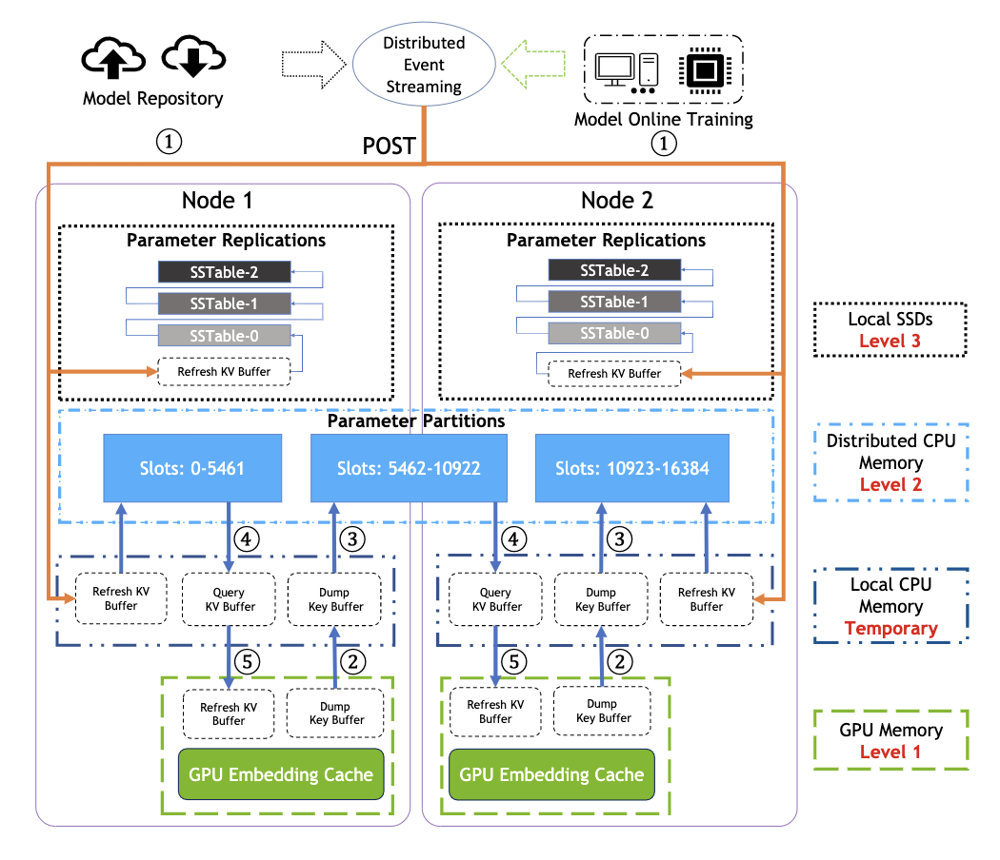

HugeCTR Inference Architecture
==============================

The HugeCTR Backend is a GPU-accelerated recommender model deployment framework that is designed to effectively use the GPU memory to accelerate the inference through decoupling the Parameter Server, embedding cache, and model weight. The HugeCTR Backend supports concurrent model inference execution across multiple GPUs through the use of an embedding cache that is shared between multiple model instances.

## Design
The HugeCTR Backend adopts a hierarchical framework to prevent services from being affected in multiple models that are deployed on multiple GPUs by isolating the loading of embedding tables through the Parameter Server, as well as achieving high service availability through the embedding cache. The GPU cache is used to accelerate the embedding vector lookup efficiency during the inference process. 

The HugeCTR Backend also offers the following:

* **Concurrent Model Execution**: Multiple models and instances of the same model can run simultaneously on the same GPU or multiple GPUs.
* **Extensible Backends**: The Inference interface provided by HugeCTR can be easily integrated with the backend API, which allows models to be extended with any execution logic using Python or C++.
* **Easy Deployment of New Models**: Updating a model should be as transparent as possible and should not affect the inference performance. This means that no matter how many models need to be deployed, as long as these models were trained using HugeCTR, they can be loaded through the same HugeCTR backend API. **Note**: It might be necessary to update configuration files for each model in some cases.

### HugeCTR Backend Framework
The following components make up the HugeCTR Backend framework:

* The **Parameter Server** is responsible for loading and managing large embedding tables that belong to different models. The embedding tables provide syncup and update services for the embedding cache. It also ensures that the embedding table is completely loaded and updated regularly.
* The **Embedding Cache** can be loaded directly into the GPU memory. Thereby, it provides embedding vector lookup functionalities for the model, thus, avoiding the comparatively high latencies incurred when transferring data  from the Parameter Server (CPU and GPU transfer). It also provides the update mechanism for loading the latest cached embedding vector in time to ensure a high hit througput rate.
* The **Model** is much smaller than the embedding table, so it can usually be directly loaded into the GPU memory to accelerate inference. The model can interact directly with the embedding cache in the GPU memory to obtain embedding vectors. Based on the hierarchical design structure, multiple model instances will share embedding cache in the GPU memory to enforce concurrent model execution. Based on the dependencies of the hierarchical level, the embedding table can be decoupled from the lookup operation of the model, which implements an efficient and low-latency lookup operation by relying on the embedding cache. This makes it possible to implement inference logic using interface-by-interface initialization and dependency injection.  

Here's an in-depth look into the design framework of the HugeCTR Inference interface:

<div align=center></div>
<div align=center>Fig. 1. HugeCTR Inference Design Architecture</div>

In actual applications, a Parameter Server is used to load the embedding tables for all models. Since different models will obtain different embedding tables by training in different application scenarios, high memory overheads are to be expected during the inference process. By introducing a Parameter Server, the embedding table can be loaded directly into the GPU memory when the embedding table size is small, or if the GPU resources are exhausted, be loaded into the CPU's memory, or even into the solid-state drive (SSD) when the embedding table size is too large. This ensures that different models and the embedding tables shared between these models are isolated.

Each embedding table will create an individual embedding cache on different GPUs. The embedding cache treats the embedding table as the smallest granularity, which means that the embedding cache can look up and synchronize with the corresponding embedding table directly. This mechanism ensures that multiple model instances for the same model can share the same embedding cache on the deployed GPU node. 

### Enabling the GPU Embedding Cache
When the GPU embedding cache mechanism is enabled, the model will look up the embedding vector from the GPU embedding cache. If the embedding vector does not exist in the GPU embedding cache, it will return the default embedding vector. The default value is 0.  
 
The following parameters have to be set in the config.pbtxt file for the HugeCTR Backend:

 ```json.
 parameters [
...
   {
  key: "gpucache"
  value: { string_value: "true" }
  },
  {
  key: "gpucacheper"
  value: { string_value: "0.5" }
  },
...
]
```

* **gpucache**: Use this option to enable the GPU embedding cache mechanism.
* **gpucacheper**: Determines what percentage of the embedding vectors will be loaded from the embedding table into the GPU embedding cache. The default value is 0.5. Hence, in the above example, 50% of the embedding table will be loaded into the GPU embedding cache.

 ```json.
 ...
"inference": {
    "max_batchsize": 64,
    "hit_rate_threshold": 0.6,
    "dense_model_file": "/model/dcn/1/_dense_10000.model",
    "sparse_model_file": "/model/dcn/1/0_sparse_10000.model",
    "label": 1
  },

...
]
```

* **hit_rate_threshold**: This option determines the insertion mechanism of the embedding cache and Parameter Server based on the hit rate.  The insertion operation will choose to insert the missing key synchronously or asynchronously according to the hit rate of the current embedding cache. 
   * If the real hit rate of the GPU embedding cache lookup embedding keys is lower than the user-defined threshold, the GPU embedding cache will insert the missing vector into the embedding cache synchronously. 
   * If the real hit rate of the GPU embedding cache lookup is greater than the threshold set by the user, the GPU embedding cache will choose to insert the missing key asynchronously.  

   The hit rate threshold must be set in the Parameter Server JSON file. For example, see [HugeCTR Backend configuration]( ../samples/README.md#HugeCTR_Backend_configuration). 

* **Periodically refresh the embedding cache**: Refresh operation will be triggered when the sparse model files need to be updated into GPU embedding cache. After completing the version iteration or incremental parameters update of the model on the training side, the latest embedding table needs to be updated to the embedding cache on the inference server. In order to ensure that the running model can be updated online, we will update the Localized RocksDB and Distributed Redis Cluster through the distributed event streaming platform(Kafka). At the same time, the embedding  keys in the GPU embedding cache are periodically refreshed based on the `"refresh_interval"` seconds configured by user, which should be added into customized  `parameters` block in `config.pbtxt` file as follows:

```json.
 ...
  parameters [
  {
  ...,
  {
  key: "refresh_interval"
  value: { string_value: "0" }
  },
...
]
```  
  Please refer to [HugeCTR Backend configuration]( ../samples/README.md#HugeCTR_Backend_configuration) for details.  

### Disabling the GPU Embedding Cache
When the GPU embedding cache mechanism is disabled (i.e., `"gpucache"` is set to `false`), the model will directly look up the embedding vector from the Parameter Server. In this case, all remaining settings pertaining to the GPU embedding cache will be ignored.

## Localized Deployment
The Parameter Server implements localized deployment on the same nodes and cluster. Each node only has one GPU and Parameter Server that is deployed on the same node. Here are several deployment scenarios that HugeCTR supports:

* Scenario 1: One GPU (Node 1) deploys one model so that the hit rate of the embedding cache will be maximized by launching multiple parallel instances.
* Scenario 2: One GPU (Node 2) deploys multiple models so that the GPU resources can be maximized. A balance between the number of concurrent instances and multiple embedding caches is needed to ensure efficient use of the GPU memory. Data transmission between each embedding cache and Parameter Server will be an independent cuda stream.  

  **NOTE**: Multiple GPUs and a Parameter Server is deployed on each node in the examples noted below.
  
* Scenario 3: Multiple GPUs (Node 3) deploys a single model in which the Parameter Server can help increase the hit rate of the embedding cache between GPUs.
* Scenario 4: Multiple GPUs (Node 4) deploys multiple models, and with this being the most complicated scenario for localized deployment, it is necessary to ensure that different embedding caches can share the same Parameter Server and different models can share embedding caches on the same node.  

<div align=center></div>
<div align=center>Fig. 2. HugeCTR Inference Localized Deployment Architecture</div>  
  
    
## Distributed Deployment with Hierarchical HugeCTR Parameter Server ##
The hierarchical HugeCTR parameter server (PS) allows deploying models that exceed the existing GPU memory space, while retaining a relatively low latency. To provide this functionality, our PS exhibits a hierarchical structure that can make use of the various memory resources of each cluster node. In other words, the hierachical parameter server utilizes Random Access Memory (RAM) and non-volatile memory resources in your cluster to extend the embedding cache and allow faster response times for ver large datasets.

At the bottom of the hierachy exists a permanent storage layer that maintains a full copy of your embedding tables in an inexpensive non-volatile memory location (typically file-system-based, e.g., a SSD/HDD). To improve access performance, various volatile memories such as local, but also remote RAM-resources can be utilized, thus, forming a cache hierarchy.

As of version 3.3 of HugeCTR individual hierarchy stages of the hierachical parameter server are individually configurable. To introduce the concept, we next present a minimal configuration, where the local SSD/HDD of each node stores a fallback copy of the entire embedding table in a RocksDB column group, and via a Redis cluster, portions of the RAM in each node are used as a cache for frequently used embeddings. This configuration is equivalent to `"db_type" = "hierarchy"` in previous versions of HugeCTR.

```json
{
    "supportlonglong": false,
    ...
    "cpu_memory_db": {
      "type": "disabled"
    },
    "distributed_db": {
      "type": "redis_cluster",
      "address": "192.168.0.10:7000;192.168.0.20:7000;192.168.0.30:7000",
      "num_partitions": 8,
      "overflow_margin": 10000000
    },
    "peristent_db": {
      "type": "rocksdb",
      "path": "/root/hctr_rocksdb"
    },
    ...
    "models": [
      ...
    ]
}
```
Hence, we disable local CPU memory caching *(enabled by default)*, and instead tell HugeCTR to split the embedding table into `8` partitions, which should be spread accross a `3`-node `Redis cluster`. Partition assignments depends on the last couple of bits of your embedding keys. Hence, if the keys are somewhat uniformly distributed, you can expect that the cache partitions will also be filled at an approximately equal rate. The overflow margin upper-bounds the amount of embeddings that will be cached to `10 million` per partition. Thus, at any time at most `80 million` embedding table records will be cached by this Redis cluster. A copy of all records will be maintained in a `RocksDB` instance. Thus, any embeddings for keys that that are not yet or not anymore cached in the Redis cluster, will be looked up in this RocksDB database.


* **Distributed Redis Cluster**  
Synchronous query for Redis cluster: Each Model instance looks up the required embedding keys from the localized GPU cache, which will also store the missing embedding keys (Keys not found in the GPU cache) into missing keys buffer. The missing keys buffer is exchanged with the Redis instance synchronously, which in turn performs the look up operation on any missing embedding keys. Thereby, the distributed Redis cluster acts as a 2nd-level cache that can completely replace the localized parameter server for loading the complete embedded table of all models. 

  Users only need to set the ip and port of each node to enable the Redis cluster service into the HugeCTR Hierarchical Parameter Server. However, the Redis cluster as a distributed memory cache is still limited by the size of CPU memory in each node. In other words, the size of the embedded table of all models still cannot exceed the total CPU memory of the cluster. Therefore, the user can use `"initial_cache_rate"` in `distributed_db` block to control the size of the model embedding table loaded into the Redis cluster.
  
  To take advantage of an Redis cluster with HugeCTR, the following configuration options need to be added to be added to ps.json:

  ```
  {
    "supportlonglong": false,
    ...
    "distributed_db": {
      "type": "redis_cluster",
      "address": "192.168.0.10:7000;192.168.0.20:7000;192.168.0.30:7000",
      "num_partitions": 8,
      "initial_cache_rate": 0.5,
      "overflow_margin": 10000000
    },
    ...
    "models": [
      ...
    ]
  }
  ```
* **Localized RocksDB**:  
For ultra-large-scale embedding tables that still cannot fully load into the Redis cluster, we will enable local key-value storage (RocksDB) on each node.

  Synchronous query for RocksDB: When the Redis cluster client looks up the embedding keys from the distributed GPU cache, it takes note of missing embedding keys (Keys not found in the Redis cluster) and records them in a missing key buffer. The missing keys buffer is exchanged with the local RocksDB client synchronously, which will then attempt to look up of these keys in the local SSDs. Eventually, the SSD query engine will perform the third look up operation for the missing embedded keys of all models.
  
  For model repositories that have been stored in the cloud, RocksDB will be used as a local SSDs cache to store the remaining parts that cannot be loaded by the Redis cluster. Thus, in practice, the localized RocksDB instances acts as a 3rd-level cache.

  The configuration of the localized RocksDB needs to be added to ps.json as shown below:

  ```
  {
    "supportlonglong":false,
    ...
    "peristent_db": {
      "type": "rocksdb",
      "path": "/root/hctr_rocksdb"
    },
    ...
    "models":[
      ...
    ]
  }
  ```

<div align=center></div>
<div align=center>Fig. 3. HugeCTR Inference Distributed Deployment Architecture</div>

## Variant Compressed Sparse Row Input ##
The Variant Compressed Sparse Row (CSR) data format is typically used as input for HugeCTR models. It allows efficiently reading the data, obtaining data semantic information from the raw data, and avoids consuming too much time for data parsing. NVTabular has to output the corresponding slot information to indicate the feature files for the categorical data. Using the variant CSR data format, the model obtains the feature field information when reading data from the request. Addtionally, the inference process is sped up by avoiding excessive request data processing. For each sample, there are three main types of input data: 
 
* **Dense Feature**: Represents the actual numerical data.
* **Column Indices**: The upstream preprocessing tool where NVTabular performs one-hot and multi-hot encoding on categorical data and converts it into numerical data.  
* **Row ptr**: Contains the number of categorical features per slot. 

<div align=center></div>
<div align=center>Fig. 4. HugeCTR Inference VCSR Input Format</div>

### VCSR Example
#### Single Embedding Table Per Model
Take the **Row 0**, a sample, of the figure above as an example. The input data contains four slots and HugeCTR parses the Row 0 slot information according to the "Row ptr" input. All the embedding vectors are stored in a single embedding table.

<div align=center></div>
<div align=center>Fig. 5. HugeCTR Inference VCSR Example for Single Embedding Table per Model</div>

* Slot 1: Contains **1** categorical feature and the embedding key is 1. 
* Slot 2: Contains **1** categorical feature and the embedding key is 3.
* Slot 3: Contains **0** categorical features.
* Slot 4: Contains **2** categorical features and the embedding keys are 8 and 9. HugeCTR will look up two embedding vectors from the GPU's embedding cache or the Parameter Server and end up with one final embedding vector for slot 4.

#### Multiple Embedding Table Per Model

Again, we take the **Row 0**, a sample, of the figure above as an example. However, this time we assume that the input data consists of four slots, where the first two slots (Slot 1 and Slot 2) belong to the first embedding table, and the last two slots (Slot 3 and Slot 4) belong to the second table. So two independent **Row prts** are required to form the complete **Row prts** in the input data.

<div align=center></div>
<div align=center>Fig. 5. HugeCTR Inference VCSR Example for Muliple Embedding Tables per Model</div>

* Slot 1: Contains **1** categorical feature and the embedding key is 1. The corresponding embedding vector is stored in embedding table 1.  
* Slot 2: Contains **1** categorical feature and the embedding key is 3. The corresponding embedding vector is stored in embedding table 1.
* Slot 3: Contains **0** categorical features.
* Slot 4: Contains **2** categorical features and the embedding keys are 8 and 9. The corresponding embedding vectors are stored in embedding table 2. In this case, HugeCTR will look up two embedding vectors from the GPU's embedding cache or the Parameter Server and end up with one final embedding vector for slot 4.
