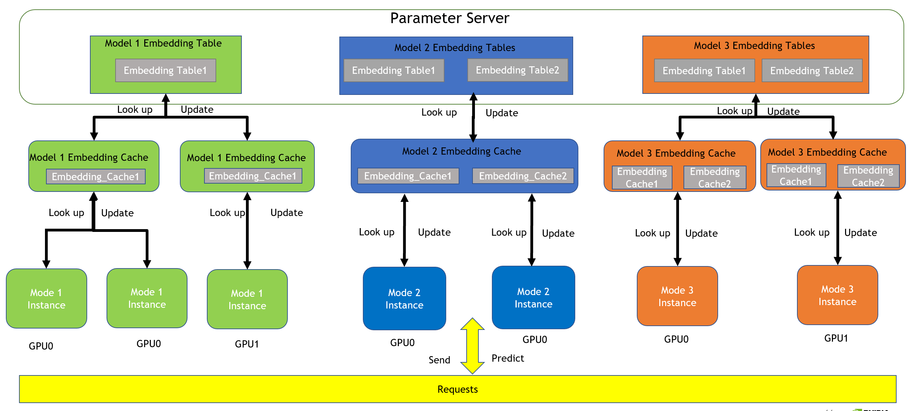

HugeCTR Inference Architecture
==============================

The HugeCTR Backend is a GPU-accelerated recommender model deployment framework that was designed to effectively use the GPU memory to accelerate the inference through decoupling the Parameter Server, embedding cache, and model weight. The HugeCTR Backend supports concurrent model inference execution across multiple GPUs through the use of embedding cache that is shared between multiple model instances.
  
## Design
The HugeCTR Backend adopts a hierarchical framework to prevent services from being affected in multiple models that are deployed on multiple GPUs by isolating the loading of embedding tables through the Parameter Server, as well as achieving high service availability through the embedding cache. The GPU cache is used to accelerate the embedding vector lookup efficiency during the inference process. 

The HugeCTR Backend also offers the following:

* **Concurrent Model Execution**: Multiple models and instances of the same model can run simultaneously on the same GPU or multiple GPUs.
* **Extensible Backends**: The Inference interface provided by HugeCTR can be easily integrated with the backend API, which allows models to be extended with any execution logic using Python or C++.  
* **Easy Deployment of New Models**: Updating a model should be as transparent as possible and shouldn’t affect the inference performance. This means that no matter how many models need to be deployed, as long as the models are trained by HugeCTR, they can be loaded through the same HugeCTR backend API. The configuration files must be updated for each model.  

### HugeCTR Backend Framework
The following components make up the HugeCTR Backend framework:

* **Parameter Server**: It is used to load and manage large embedding tables that belong to different models. The embedding tables provide syncup and update service for the embedding cache. It also ensures that the embedding table is completely loaded and updated regularly.   
* **Embedding Cache**: It can be loaded directly into the GPU memory while providing an embedding vector lookup service for the model and avoiding the high latency caused between the CPU and GPU from the Parameter Server. It also provides the update mechanism for loading the latest cached embedding vector in time to ensure a high hit rate.  
* **Model**: It is much smaller than the embedding table, so it can be directly loaded into the GPU memory to accelerate inference. The model can interact directly with the embedding cache in the GPU memory to obtain embedding vectors. Based on the hierarchical design structure, multiple model instances will share embedding cache in the GPU memory to enforce concurrent model execution. Based on the dependencies of the hierarchical level, the embedding table can be decoupled from the lookup operation of the model, which implements an efficient and low-latency lookup operation by relying on the embedding cache. This makes it possible to implement inference logic using interface-by-interface initialization and dependency injection.  

Here's an in-depth look into the design framework of the HugeCTR Inference interface:

<div align=center></div>
<div align=center>Fig. 1. HugeCTR Inference Design Architecture</div>  
  
In actual applications, a Parameter Server is used to load the embedding tables for all models. Since different models will obtain different embedding tables by training in different application scenarios, high memory overhead will be needed during the inference process. By introducing a Parameter Server, the embedding table can be loaded directly into the GPU memory when the embedding table size is small and loaded into the CPU's memory or even into the solid-state drive (SSD) when the embedding table size is too large. This ensures that  different models and the embedding tables shared between these models are isolated.  

Each embedding table will create an individual embedding cache on different GPUs. The embedding cache treats the embedding table as the smallest granularity, which means that the embedding cache can look up and synchronize with the corresponding embedding table directly. The current mechanism ensures that multiple model instances for the same model can share the same embedding cache on the deployed GPU node. 

### Enabling the GPU Embedding Cache
When the GPU cache mechanism is enabled, the model will look up the embedding vector from the GPU embedding cache. If the embedding vector does not exist in the GPU embedding cache, it will return the default embedding vector. The default value is 0.  
 
The following parameters have to be set in the config.pbtxt file for the HugeCTR Backend:  

 ```json.
 parameters [
...
   {
  key: "gpucache"
  value: { string_value: "true" }
  },
  {
  key: "gpucacheper"
  value: { string_value: "0.5" }
  },
...
]
```

* **gpucache**: Use this option to enable the GPU cache mechanism.   
* **gpucacheper**: Use this option to determine which percentage of the embedding vectors will be loaded from the embedding table into the GPU embedding cache. The default value is 0.5. In the above example, 50% of the embedding table will be loaded into the GPU embedding cache.

 ```json.
 ...
"inference": {
    "max_batchsize": 64,
    "hit_rate_threshold": 0.6,
    "dense_model_file": "/model/dcn/1/_dense_10000.model",
    "sparse_model_file": "/model/dcn/1/0_sparse_10000.model",
    "label": 1
  },

...
]
```

* **hit_rate_threshold**: Use this option to determine the updating mechanism of the embedding cache and Parameter Server based on the hit rate. If the hit rate of an embedding vector lookup is lower than the set threshold, the GPU embedding cache will update the missing vector on the Parameter Server. The GPU embedding cache also supports the embedding vector updates from the Parameter Server in a fixed hit ratio. The hit rate threshold must be set in the model inference configuration JSON file. For example, [dcn.json](https://gitlab-master.nvidia.com/dl/hugectr/hugectr_inference_backend/-/blob/main/samples/dcn/1/dcn.json) and [deepfm.json](https://gitlab-master.nvidia.com/dl/hugectr/hugectr_inference_backend/-/blob/main/samples/deepfm/1/deepfm.json). 

### Disabling the GPU Embedding Cache
When the GPU embedding cache mechanism is disabled ("gpucache" is set to false), the model will look up the embedding vector from the Parameter Server directly. All settings related to the GPU embedding cache will be invalid.  

## Localized Deployment
The Parameter Server implements localized deployment on the same nodes and cluster. Each node only has one GPU and Parameter Server that is deployed on the same node. Here are several deployment scenarios that HugeCTR supports:

* Scenario 1: One GPU (Node 1) deploys one model so that the hit rate of the embedding cache will be maximized by launching multiple parallel instances.
* Scenario 2: One GPU (Node 2) deploys multiple models so that the GPU resources can be maximized. A balance between the number of concurrent instances and multiple embedding caches is needed to ensure efficient use of the GPU memory. Data transmission between each embedding cache and Parameter Server will be an independent cuda stream.  

  **NOTE**: Multiple GPUs and a Parameter Server is deployed on each node in the examples noted below.
  
* Scenario 3: Multiple GPUs (Node 3) deploys a single model in which the Parameter Server can help increase the hit rate of the embedding cache between GPUs.
* Scenario 4: Multiple GPUs (Node 4) deploys multiple models, and with this being the most complicated scenario for localized deployment, it is necessary to ensure that different embedding caches can share the same Parameter Server and different models can share embedding caches on the same node.  

<div align=center></div>
<div align=center>Fig. 2. HugeCTR Inference Localized Deployment Architecture</div>  
  
    
## Distributed Deployment with Hierarchical HugeCTR Parameter Server ##
The distributed Redis cluster is introduced as a CPU cache to store larger embedding tables and interact with the GPU embedding cache directly. The local RocksDB serves as a query engine to back up the complete embedding table on the local SSDs in order to assist the Redis cluster to perform missing embedding keys look up.
To enable hierarchical service, they need to add the `"db_type"` configuration item to ps.json as `"hierarchy"` .

```
{
    "supportlonglong":false,
    ...
    "db_type":"hierarchy",
    ...
    "models":[
      ...
    ]
}
```
* **Distributed Redis Cluster**  
Synchronous query for Redis cluster: Model Instance looks up the embedding keys from the localized GPU cache, which will also store the missing embedding keys(Keys not found in the GPU cache) into missing keys buffer.The missing buffer is exchanged to the Redis Instance synchronously, and Redis cluster client performs the look up operation on the missing embedding keys. The distributed Redis cluster as the 2nd-level cache will completely replace the localized parameter server for loading the complete embedded table of all models.  
However, the Redis cluster as a distributed memory cache is still limited by the size of CPU memory in each node, in other words, the size of the embedded table of all models still cannot exceed the total CPU memory of the cluster. Therefore, the user can use `"cache_size_percentage_redis"` to control the size of the model embedding table loaded into the Redis cluster. Users only need to set the ip and port of each node to enable the Redis cluster service into the HugeCTR Hierarchical Parameter Server.
The configuration of the Redis cluster needs to be added to ps.json as shown below:  


```
{
    "supportlonglong":false,
    ...
    "db_type":"hierarchy",
    "redis_ip":"node1_ip:port,node2_ip:port,node3_ip:port,...",
    "cache_size_percentage_redis":"0.5",
    ...
    "models":[
      ...
    ]
}
```
* **Locaized RocksDB (Key-Value Store)**:  
For ultra-large-scale embedding tables that still cannot fully load into the Redis cluster, we will enable local key-value storage on each node.
Synchronous query for RocksDB: Redis cluster client looks up the embedding keys from the distributed GPU cache, which will also store the missing embedding keys(Keys not found in the Redis cluster) into missing key buffer.The missing keys buffer is exchanged to the local RocksDB client synchronously, which will continue to look up the missing embedding keys in the local SSDs. The localized RocksDB as the 3rd-level SSD query engine will perform the third look up operation for the missing embedded keys of all models.  
For the model repository that have been stored in the cloud, RocksDB will be used as a local SSDs cache to store the remaining parts that cannot be loaded by the Redis cluster.  
The configuration of the localized RocksDB needs to be added to ps.json as shown below:

```
{
    "supportlonglong":false,
    ...
    "db_type":"hierarchy",
    "rocksdb_path":"/current_node/rocksdb_path",
    ...
    "models":[
      ...
    ]
}
```


<div align=center></div>
<div align=center>Fig. 3. HugeCTR Inference Distributed Deployment Architecture</div>

## Variant Compressed Sparse Row Input ##
The Variant Compressed Sparse Row (CSR) data format is used as input for the HugeCTR model to efficiently read the data, obtain data semantic information from the raw data, and avoid consuming too much time for data parsing. NVTabular has to output the corresponding slot information to indicate the feature files for the categorical data. Using the variant CSR data format, the model obtains the feature field information when reading data from the request, and the inference process is sped up and avoid excessive request data processing. For each sample, there are three main types of input data: 
 
* **Dense Feature**: Represents normal numerical data.
* **Column Indices**: The upstream preprocessing tool where NVTabular performs one-hot and multi-hot encoding on categorical data and converts it into numerical data.  
* **Row ptr**: Provides the number of categorical features in each slot. 

<div align=center></div>
<div align=center>Fig. 4. HugeCTR Inference VCSR Input Format</div>

### VCSR Example
#### Single Embedding Table Per Model
Take the **Row 0**, a sample, of the figure above as an example. The input data contains four slots and HugeCTR parses the Row 0 slot information according to the "Row ptr" input. All the embedding vectors are stored in a single embedding table.

<div align=center></div>
<div align=center>Fig. 5. HugeCTR Inference VCSR Example for Single Embedding Table per Model</div>

* slot 1: Contains **1** categorical feature and the embedding key is 1. 
* slot 2: Contains **1** categorical feature and the embedding key is 3.
* slot 3: Contains **0** categorical features.
* slot 4: Contains **2** categorical features and the embedding keys are 8 and 9. HugeCTR will look up two embedding vectors from the GPU's embedding cache or the Parameter Server and end up with one final embedding vector for slot 4.

#### Multiple Embedding Table Per Model

Take the **Row 0**, a sample, of the figure above as an example. The input data contains four slots and the first two slots(slot1 and slot2) belong to the first embedding table, the last two slots(slot3 and slot4) belong to the second table. So two independent **Row prts** are required to form a complete **Row prts** in the input data.

<div align=center></div>
<div align=center>Fig. 5. HugeCTR Inference VCSR Example for Muliple Embedding Tables per Model</div>

* slot 1: Contains **1** categorical feature and the embedding key is 1 and corresponding embedding vector is stored in embedding table 1.  
* slot 2: Contains **1** categorical feature and the embedding key is 3 and and corresponding embedding vector is stored in embedding table 1.
* slot 3: Contains **0** categorical features.
* slot 4: Contains **2** categorical features and the embedding keys are 8 and 9, the corresponding embedding vectors is stored in embedding table 2.HugeCTR will look up two embedding vectors from the GPU's embedding cache or the Parameter Server and end up with one final embedding vector for slot 4.
