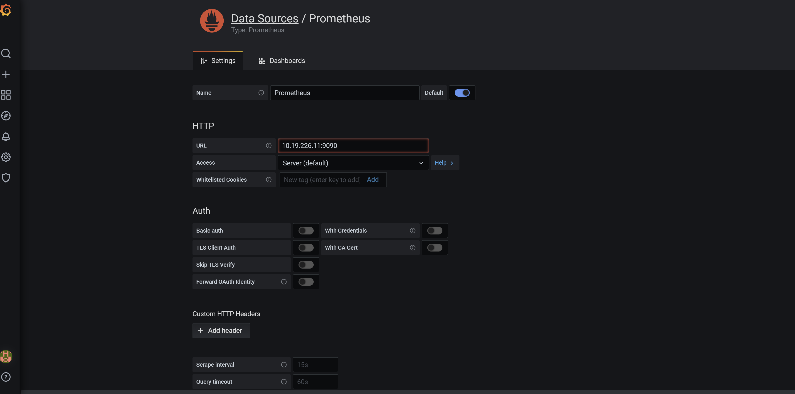
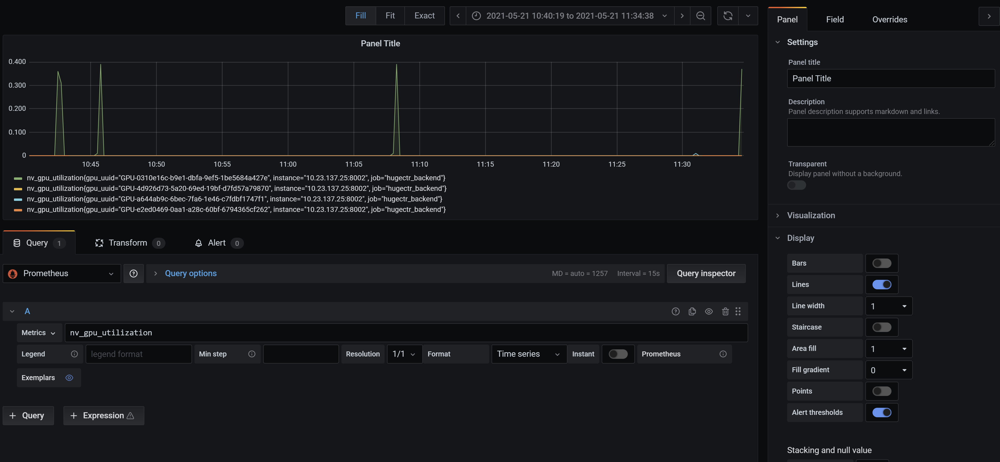

<!--
# Copyright (c) 2020, NVIDIA CORPORATION. All rights reserved.
#
# Redistribution and use in source and binary forms, with or without
# modification, are permitted provided that the following conditions
# are met:
#  * Redistributions of source code must retain the above copyright
#    notice, this list of conditions and the following disclaimer.
#  * Redistributions in binary form must reproduce the above copyright
#    notice, this list of conditions and the following disclaimer in the
#    documentation and/or other materials provided with the distribution.
#  * Neither the name of NVIDIA CORPORATION nor the names of its
#    contributors may be used to endorse or promote products derived
#    from this software without specific prior written permission.
#
# THIS SOFTWARE IS PROVIDED BY THE COPYRIGHT HOLDERS ``AS IS'' AND ANY
# EXPRESS OR IMPLIED WARRANTIES, INCLUDING, BUT NOT LIMITED TO, THE
# IMPLIED WARRANTIES OF MERCHANTABILITY AND FITNESS FOR A PARTICULAR
# PURPOSE ARE DISCLAIMED.  IN NO EVENT SHALL THE COPYRIGHT OWNER OR
# CONTRIBUTORS BE LIABLE FOR ANY DIRECT, INDIRECT, INCIDENTAL, SPECIAL,
# EXEMPLARY, OR CONSEQUENTIAL DAMAGES (INCLUDING, BUT NOT LIMITED TO,
# PROCUREMENT OF SUBSTITUTE GOODS OR SERVICES; LOSS OF USE, DATA, OR
# PROFITS; OR BUSINESS INTERRUPTION) HOWEVER CAUSED AND ON ANY THEORY
# OF LIABILITY, WHETHER IN CONTRACT, STRICT LIABILITY, OR TORT
# (INCLUDING NEGLIGENCE OR OTHERWISE) ARISING IN ANY WAY OUT OF THE USE
# OF THIS SOFTWARE, EVEN IF ADVISED OF THE POSSIBILITY OF SUCH DAMAGE.
-->
 
[](https://opensource.org/licenses/BSD-3-Clause)
 
HugeCTR Backend Metrics
==============================
 
Prometheus is an open monitoring solution. Users can easily install and use Prometheus and can easily expand it. In order to have a more intuitive understanding of the performance of hugectr backend in inference,we will deploy and run a Prometheus Server instance locally, and collect all kinds of indicators for runtime inference by Triton metrics API. And create a simple visual dashboard through Grafana.
  
## Install the Prometheus Server
 
The compiled software package of Prometheus does not depend on any third-party dependencies. Users only need to download the binary package of the corresponding platform, decompress and add basic configuration to start Prometheus Server normally.
 
### Pre-compiled Binaries
For non-Docker users, you can find the latest version of the Prometheus Server package from https://prometheus.io/download/ :
```
export VERSION=2.27.1
curl -LO  https://github.com/prometheus/prometheus/releases/download/v$VERSION/prometheus-$VERSION.linux-amd64.tar.gz
```
 
Unzip and add Prometheus-related commands to the system environment variable path as following:
```
tar -xzf prometheus-${VERSION}.linux-amd64.tar.gz
cd prometheus-${VERSION}.linux-amd64
```
 
After decompression, the current directory will contain the default Prometheus configuration file promethes.yml:
 
 ```json.
# my global config
global:
  scrape_interval:     15s # Set the scrape interval to every 15 seconds. Default is every 1 minute.
  evaluation_interval: 15s # Evaluate rules every 15 seconds. The default is every 1 minute.
  # scrape_timeout is set to the global default (10s).
 
# Alertmanager configuration
alerting:
  alertmanagers:
  - static_configs:
    - targets:
      # - alertmanager:9093
 
# Load rules once and periodically evaluate them according to the global 'evaluation_interval'.
rule_files:
  # - "first_rules.yml"
  # - "second_rules.yml"
 
# A scrape configuration containing exactly one endpoint to scrape:
# Here it's Prometheus itself.
scrape_configs:
  # The job name is added as a label `job=<job_name>` to any timeseries scraped from this config.
  - job_name: 'prometheus'
 
    # metrics_path defaults to '/metrics'
    # scheme defaults to 'http'.
 
    static_configs:
    - targets: ['localhost:9090']
```
 
Prometheus is a time series database, and the collected data will be stored locally in the file. The default storage path is data/, so we need to manually create the directory first:
 
```
mkdir -p data
```
Users can also modify the path of local data storage through the parameter --storage.tsdb.path="data/".
 
Start the prometheus service, which will load the prometheus.yaml file in the current path by default:
```
./prometheus
```
If the Prometheus server starts normally, there will be the following output:
```
level=info ts=2021-05-20T15:32:45.659Z caller=main.go:673 msg="TSDB started"
level=info ts=2021-05-20T15:32:45.659Z caller=main.go:743 msg="Loading configuration file" filename=prometheus.yml
level=info ts=2021-05-20T15:32:45.660Z caller=main.go:771 msg="Completed loading of configuration file" filename=prometheus.yml
level=info ts=2021-05-20T15:32:45.660Z caller=main.go:626 msg="Server is ready to receive web requests."
```
 
## Initial HugeCTR Backend Monitoring Indicators
 
Triton provides Prometheus metrics indicating GPU and request statistics. By default, these metrics are available at http://localhost:8002/metrics. The metrics are only available by accessing the endpoint, and are not pushed or published to any remote server. The metric format is plain text so you can view them directly, for example:
```
$ curl localhost:8002/metrics
```
The tritonserver **--allow-metrics=true** option can be used to enable all metric reporting and **--allow-gpu-metrics=true** can be used to enable just the GPU Utilization and GPU Memory metrics. The **--metrics-port** option can be used to select a different port.
 
You can refer to [Triton Metrics](https://github.com/triton-inference-server/server/blob/main/docs/metrics.md) for details.
 
Before each monitoring indicator, there will be a piece of information similar to the following:
 
```
# HELP nv_inference_compute_output_duration_us Cumulative inference compute output duration in microseconds
# TYPE nv_inference_compute_output_duration_us counter
nv_inference_compute_output_duration_us{gpu_uuid="GPU-e2ed0469-0aa1-a28c-60bf-6794365cf262",model="dlrm",version="2"} 0.000000
# HELP nv_gpu_utilization GPU utilization rate [0.0 - 1.0)
# TYPE nv_gpu_utilization gauge
nv_gpu_utilization{gpu_uuid="GPU-a644ab9c-6bec-7fa6-1e46-c7fdbf1747f1"} 0.000000
nv_gpu_utilization{gpu_uuid="GPU-e2ed0469-0aa1-a28c-60bf-6794365cf262"} 0.000000
nv_gpu_utilization{gpu_uuid="GPU-4d926d73-5a20-69ed-19bf-d7fd57a79870"} 0.000000
nv_gpu_utilization{gpu_uuid="GPU-0310e16c-b9e1-dbfa-9ef5-1be5684a427e"} 0.000000
```  
Among them, **HELP** is used to explain the meaning of the current indicator, and **TYPE** is the data type of the following indicator. In the above example, the note of **nv_inference_compute_output_duration_us** indicates that the current time cost for compute the output for request within a fixed time window. The nv_inference_compute_output_duration_us is a metric that only increases and does not decrease. It can also be seen from the type that the data type of nv_inference_compute_output_duration_us is **counter**, consistent with the actual meaning of the indicator. Another example is **nv_gpu_utilization**. This indicator reflects the utilization of within the last second. Therefore, nv_gpu_utilization reflects the current state. The data may increase or decrease. From the comments, you can see that the current indicator type is **gauge**, which is consistent with the actual meaning reflected by the indicator.
 
 
## Collect Monitoring Data from Triton Metrics
In order to enable Prometheus Server to obtain monitoring data from the current HugeCTR Backend, the Prometheus configuration file needs to be modified as follows. Edit prometheus.yml and add the following content under the scrape_configs node:
 ```
 scrape_configs:
  - job_name: 'prometheus'
    static_configs:
      - targets: ['localhost:9090']
  # Collect HugeCTR Backend performance indicators
  - job_name: 'hugectr_backend'
    static_configs:
      - targets: ['inference_node:8002']
```
 
Restart Prometheus Server
 
Visit http://localhost:9090 to enter Prometheus Server. If you enter "up" and click the execute button, you can see the following results:
 
<div align=center></div>
<div align=center>Fig. 1. Prometheus Console for HugeCTR Backend</div>  

 
If Prometheus can get data from the node exporter normally, you will see the following results:
```
up{instance="localhost:9090",job="prometheus"} 1
up{instance="10.23.137.25:8002",job="hugectr_backend"} 1
```
Among them, "1" means normal, otherwise, "0" means abnormal.
 
## Use PromQL to Query Monitoring Data
Prometheus UI is a built-in visual management interface of Prometheus. Through Prometheus UI, users can easily understand the current configuration of Prometheus and monitor the running status of tasks. Through the Graph panel, users can directly use PromQL to query monitoring data in real time.  
 
Switch to the Graph panel, and users can use PromQL expressions to query the monitoring data of specific monitoring indicators. As shown below, to query the utilization of GPU change, you can use the keyword **nv_gpu_utilization** to query the utilization of the GPU load collected by Prometheus. These sample data are displayed in chronological order, forming a trend chart of the nv_gpu_utilization over time:
 
<div align=center></div>
<div align=center>Fig. 2. Prometheus Graph for HugeCTR Backend</div>
 
## Use Grafana to Create a Visual Dashboard
Prometheus UI provides the ability to quickly verify PromQL and temporary visualization support. In most scenarios, the introduction of a monitoring system usually requires the construction of a long-term monitoring data visualization panel (Dashboard). Therefore, users can consider using third-party visualization tools such as Grafana. Grafana is an open source visualization platform and provides complete support for Prometheus.  
```
docker run -d -p 3000:3000 grafana/grafana
```
Visit http://localhost:3000 to enter the interface of Grafana. By default, use the account admin/admin to log in. The default usage guide is displayed on the Grafana homepage, including the main processes of installation, adding data sources, creating Dashboard, inviting members, and installing applications and plug-ins:
 
Here, Prometheus will be added as the default data source. As shown in the figure below, specify the data source type as Prometheus and set the access address of Prometheus. If the configuration is correct, click the "Add" button, and a message about successful connection will be prompted:
 
<div align=center></div>
<div align=center>Fig. 3. Add Prometheus DataSource to Grafana</div>
 
 
After adding the data source, we can create our visualization Dashboard in Grafana. Grafana provides complete support for PromQL. As shown below, add a Dashboard through Grafana and add a "Graph" panel to the Dashboard. And under the "Metrics" option of this panel, query the data that needs to be visualized through PromQL:
 
<div align=center></div>
<div align=center>Fig. 4. Grafana Dashboard for HugeCTR Backend</div>