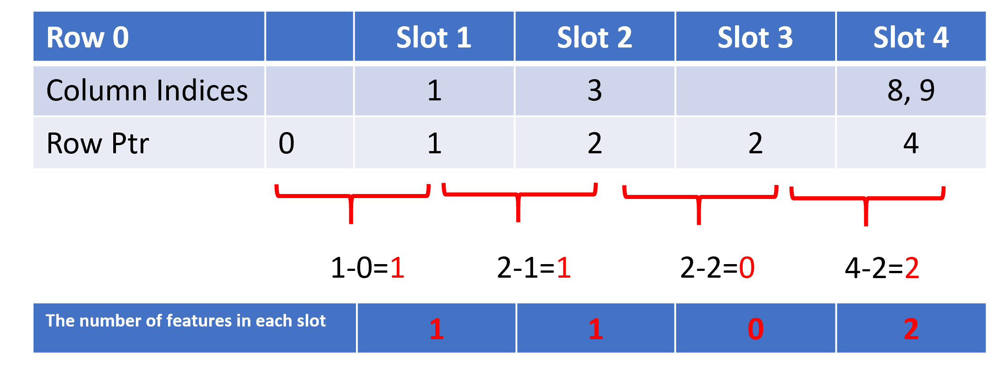

HugeCTR Inference User Guide
===================================

HugeCTR Backend is a GPU-accelerated recommender model deploy framework that was designed to effectively use GPU memory to accelerate the inference by decoupling the parameter server, embedding cache and model weight. HugeCTR Backend supports concurrent model inference execution across multiple GPUs, embedding cache sharing between multiple model instances.  
## Design Goals:
* **Hierarchical Framework**: The design of HugeCTR adopts a hierarchical framework, decoupling the model weight and embedding table, the GPU cache is used to accelerate the embedding vector look up efficiency in the inference process.  
* **Concurrent Model Execution**: Multiple models (or multiple instances of the same model) can run simultaneously on the same GPU or on multiple GPUs.
* **Extensible Backends**: The inference interface provided by HugeCTR is based on a hierarchical framework , which can be easily integrated with backend API that allows models to be extended with any execution logic implemented in Python or C++.  
* **Easy Deployment of New Models**: Updating a model should be as transparent as possible and shouldn’t affect inference performance. This means that no matter how many models need to be deployed, as long as it is a model trained by HugeCTR, it can be loaded through the same HugeCTR backend API. The user only needs to change configuration files for different models.  

## HugeCTR Inference Framework

The design of HugeCTR adopts a hierarchical framework to prevent services from being affected in multiple models deployed in multiple GPUs, providing isolated loading of embedding tables through parameter server, and achieving high service availability through embedding cache. Updating a model should be as transparent as possible and shouldn’t affect application performance.  

* Parameter server:The parameter server is used to load and manage the huge size embedding table that belongs to different modeles, which also needs to provide syncup and update service for the embedding cache. At the same time, it can ensure that the complete embedding table is loaded and updated regularly.   

* The embedding cache: can be loaded directly into the GPU memory, providing embedding vector look up service for the model, avoiding the high latency caused between CPU and GPU from parameter server. Embedding cache also provides the update mechanism to load the latest cached embedding vector in time to ensure a high hit rate.  

* Model: the model weight is much smaller than the embedding table, so it can be directly loaded into the gpu memory to accelerate inference, while the model can directly interact with the embedding cache in the GPU memory to obtain embedding vectors. Based on the hierarchical design structure, multiple model instances will share embedding cache in gpu memory to achieve the purpose of Concurrent model execution.  

Based on the dependencies of the hierarchical level, we can decouple the embedding table from the lookup operation of the model, and the model implements the efficient and low-latency look up operation by relying on the embedding cache. Allow the user implement the inference logic by interface-by-interface initialization and dependency injection.  

Here is  the complete design framework of the HugeCTR inference interface.  

<div align=center></div>
<div align=center>Fig. 1. HugeCTR Inference Design Architecture</div>  
  
In actual applications, a parameter server is used to load the embedding table of all models. Since different models will obtain different embedding tables through training in different application scenarios, it will bring high memory overhead in the inference process. By introducing a parameter server, the embedding table can be directly loaded into GPU memory when the embedding table size is small and loaded into CPU memory even SSD When the size is too large. So as to ensure the isolation of different models and the data sharing between the same models.  

Each embedding table will create an individual embedding cache on different GPUs. Embedding cache treats the embedding table as the smallest granularity, which means that embedding cache could lookup and synchronize with the corresponding embedding table directly.  

Current mechanism ensures that multiple model instances of the same model can share the same embedding cache on the deployed GPU node, embedding table will be periodically updated(or based on threshold defined by user) with the embedding cache to realize the acceleration of looking up embedding vectors from parameter server. 

### Enbale GPU Embedding Cache

If the user needs to enable the GPU cache mechanism, the model will look up the embedding vector from the GPU embedding cache. If the embedding vector does not exist in the GPU embedding cache, it will return the default embedding vector (default value is 0). 
 
The necessary configuration items need to be set in HugeCTR Backend "config.pbtxt" as follows:

 ```json.
 parameters [
...
   {
  key: "gpucache"
  value: { string_value: "true" }
  },
  {
  key: "gpucacheper"
  value: { string_value: "0.5" }
  },
...
]
```  
* **gpucache**: You can use this option to enable  the GPU cache mechanism.   
* **gpucacheper**: You can use this option to decide the ratio(default is 0.5) that embedding vectors will be loaded from the embedding table into the GPU embedding cache. In the above example, 50% of the embedding table will be loaded into the GPU embedding cache.    

GPU embedding cache also supports embedding vector updates with parameter server in a fixed hit ratio. User needs to set hit ratio threshold in model inference configuration json file, such as [dcn.json](https://gitlab-master.nvidia.com/dl/hugectr/hugectr_inference_backend/-/blob/main/samples/dcn/1/dcn.json) and [deepfm.json](https://gitlab-master.nvidia.com/dl/hugectr/hugectr_inference_backend/-/blob/main/samples/deepfm/1/deepfm.json)  

 ```json.
 ...
"inference": {
    "max_batchsize": 64,
    "hit_rate_threshold": 0.6,
    "dense_model_file": "/model/dcn/1/_dense_10000.model",
    "sparse_model_file": "/model/dcn/1/0_sparse_10000.model",
    "label": 1
  },

...
]
``` 
* **hit_rate_threshold**: You can use this option to determine that the update mechanism of embedding cache and parameter server is based on the hit rate. If the hit rate of an embedding vector looking up is lower than the threshold, the GPU embedding cache will update the missing vector with parameter server.  

### Disable GPU Embedding Cache
If the user disables the GPU embedding cache mechanism (set "gpucache" as false), the model will look up the embedding vector  from the parameter server directly, and all GPU embedding cache related settings will be invalid.  

## Localized Deployment
Here are several deployment examples for different infrastructure scenarios that HugeCTR supported. The parameter server implements localized deployment on the same nodes/cluster.  
Each node only has single gpu and parameter server is deployed on same node:  
* Scenario 1: A single GPU(Node 1) deploys a single model, the hit rate of  embedding cache will be maximized by launching multiple parallel instances
* Scenario 2: A single GPU (Node 2) deploys multiple models,  the GPU resources can be maximized. Need to find a balance between the number of concurrent instances and multiple embedding caches to ensure efficient use of GPUmemory.
Data transmission between each embedding cache and ps will be an independent cuda stream.  

Each node contains multiple GPUs and a parameter server is deployed on the same node.
* Scenario 3: Multiple GPUs (Node 3) deploys a single model, Parameter Server could also help increase the hit rate of the embedding cache between GPUs.
* Scenario 4: Multiple GPUs (Node 4) deploys multiple models, as the most complicated scenario for localized deployment, it is necessary to ensure that different embedding caches can share the same parameter server, and different models can share embedding caches on the same node.  

<div align=center></div>
<div align=center>Fig. 2. HugeCTR Inference Localized Deployment Architecture</div>

## Variant Compressed Sparse Row Input 
Here is a brief introduction to the data structure used for the HugeCTR model for inference services.  
In order to efficiently read the data to obtain the data semantic information from  the raw data and avoid consuming too much time for data parsing, we use the variant csr data format as input for HugeCTR model. For each sample, there are mainly three types of input data:  
* Dese feature: normal numerical data is called Dese feature.
* Column indices: As the upstream of preprocessing tools, NVTabular performs one-hot and multi-hot encoding on categorical data, and converts categorical data into numerical data.  
* Row ptr: NVTabular needs to output the corresponding slot information to indicate the feature filedes to corresponding categorical data. Using this variant CSR data format, the model obtains the feature field information when reading data from request,  avoiding the redundant analysis so as to speed up the inference process.

<div align=center></div>
<div align=center>Fig. 3. HugeCTR Inference VCSR Input Format</div>

### VCSR Example
Take the **Row 0** ( also a sample ) of the above figure as an example, the input data contains 4 slots, HugeCTR parses the Row 0 slot information according to "Row ptr" input. "Row ptr" input will provide the number of categorical features contained in each slot, as shown below：  

<div align=center></div>
<div align=center>Fig. 4. HugeCTR Inference VCSR Example</div>

* slot 1: contains **1** categorical feature and the embedding key is 1. 
* slot 2: contains **1** categorical feature and the embedding key is 3.
* slot 3: contains **0** categorical feature.
* slot 4: contains **2** categorical feature and the embedding keys are 8 and 9. HugeCTR will look up two embedding vectors from GPU embedding cache or parameter server and reduce to one as the final embedding vector of slot 4.


