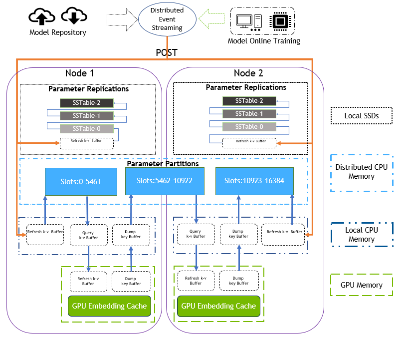

Hierarchical Parameter Server Architecture
==============================

The Hierarchical Parameter Server(HPS) Backend is a framework for embedding vectors lookup on large-scale embedding tables that was designed to effectively use GPU memory to accelerate the lookup by decoupling the embedding tables and embedding cache from the end-to-end inference pipeline of the deep recommendation model. The HPS Backend supports  executing multiple embedding vector lookup services concurrently across multiple GPUs by embedding cache that is shared between multiple look_up sessions.

## Design
The HPS Backend adopts a hierarchical framework to prevent services from being affected in multiple different lookup sevices that are deployed on multiple GPUs by isolating the loading of embedding tables through the Hierarchical Parameter Server storeage, as well as achieving high service availability through the the shared embedding cache. The GPU cache is used to accelerate the embedding vector lookup efficiency during the inference process. 

The HPS Backend also offers the following:

* **Concurrent Model Execution**: Multiple lookup sessions of the same embedding tables can run simultaneously on the same GPU or multiple GPUs.
* **Extensible Backends**: The Inference interface provided by HugeCTR can be easily integrated with the backend API, which allows models to be extended with any execution logic using Python or C++.
* **Easy Deployment of New Embedding Tables**: Updating a embedding tables should be as transparent as possible and should not affect the lookup performance. This means that no matter how many embedding tables of different models need to be deployed, as long as the training embedding table conforms to the input format of key-value pairs, it can be deployed in the HPS backend to provide efficient embedding vector lookup services, they can be loaded through the same HPS backend API. **Note**: It might be necessary to update configuration files for each model in some cases. For the specific input format of the embedding table, please refer to [here](#variant-compressed-sparse-row-input)

### HPS Backend Framework
The following components make up the HugeCTR Backend framework:

* The **Hierarchical Database Backend** is responsible for loading and managing large embedding tables that belong to different models. The embedding tables provide syncup and update services for the embedding cache. It also ensures that the embedding table is completely loaded and updated regularly.
* The **Embedding Cache** can be loaded directly into the GPU memory. Thereby, it provides embedding vector lookup functionalities for the model, thus, avoiding the comparatively high latencies incurred when transferring data  from the Parameter Server (CPU and GPU transfer). It also provides the update mechanism for loading the latest cached embedding vector in time to ensure a high hit througput rate.
* The **Lookup Session/Instance** can interact directly with the embedding cache in the GPU memory to obtain embedding vectors. Based on the hierarchical design structure, multiple lookup instances will share embedding cache in the GPU memory to enforce concurrent lookup execution. Based on the dependencies of the hierarchical storage, GPU caching completely decouples embedding vectors lookup services from the host,which implements an efficient and low-latency lookup operation by relying on the GPU embedding cache. While it also possible to implement inference logic using hierarchical initialization and dependency injection.  

Here's an in-depth look into the design framework of the HugeCTR Inference interface:

<div align=center></div>
<div align=center>Fig. 1. Hierarchical Parameter Server Design Architecture</div>

In actual applications, a Hierarchical Parameter Server is used to load the embedding tables for all models. Since different models will obtain different embedding tables by training in different application scenarios, high memory overheads are to be expected during the inference process. By introducing a Parameter Server, the embedding table can be loaded directly into the GPU memory when the embedding table size is small, or if the GPU resources are exhausted, be loaded into the CPU's memory, or even into the solid-state drive (SSD) when the embedding table size is too large. This ensures that different models and the embedding tables shared between these models are isolated.

Each embedding table will create an individual embedding cache on different GPUs. The embedding cache treats the embedding table as the smallest granularity, which means that the embedding cache can look up and synchronize with the corresponding embedding table directly. This mechanism ensures that multiple lookup instances for the same embedding table can share the same embedding cache on the deployed GPU node. 

### Enabling the GPU Embedding Cache
When the GPU embedding cache mechanism is enabled, the model will look up the embedding vector from the GPU embedding cache. If the embedding vector does not exist in the GPU embedding cache, it will return the default embedding vector. The default value is 0.  
 
The following parameters have to be set in the ps.json file for the HugeCTR Backend:

 ```json.
 ...
    "models":[
        {
            "model":"wdl",
            ...
            "gpucacheper":0.5,
            "gpucache":true
            ...
        }
    ]  
```

* **gpucache**: Use this option to enable the GPU embedding cache mechanism.
* **gpucacheper**: Determines what percentage of the embedding vectors will be loaded from the embedding table into the GPU embedding cache. The default value is 0.5. Hence, in the above example, 50% of the embedding table will be loaded into the GPU embedding cache.

 ```json.
 ...
    "models":[
    {
      ...
		  "hit_rate_threshold": 0.9,
      ...
    }
  ]  
...
]
```

* **hit_rate_threshold**: This option determines the insertion mechanism of the embedding cache and Parameter Server based on the hit rate.  The insertion operation will choose to insert the missing key synchronously or asynchronously according to the hit rate of the current embedding cache. 
   * If the real hit rate of the GPU embedding cache lookup embedding keys is lower than the user-defined threshold, the GPU embedding cache will insert the missing vector into the embedding cache synchronously. 
   * If the real hit rate of the GPU embedding cache lookup is greater than the threshold set by the user, the GPU embedding cache will choose to insert the missing key asynchronously.  

   The hit rate threshold must be set in the Parameter Server JSON file. For example, see [HugeCTR Backend configuration]( ../samples/README.md#HugeCTR_Backend_configuration). 


When the GPU embedding cache mechanism is disabled (i.e., `"gpucache"` is set to `false`), the model will directly look up the embedding vector from the Parameter Server. In this case, all remaining settings pertaining to the GPU embedding cache will be ignored.

### List of other required configurations
 ```json.
 ...
    "models":[
    {
      ...
      "model": "hps_wdl",
		  "sparse_files": ["../wdl0_sparse_2000.model", "../wdl1_sparse_2000.model"],
		  "embedding_table_names":["table1","table2"],
		  "embedding_vecsize_per_table":[1,16],
       "maxnum_catfeature_query_per_table_per_sample":[2,26],
		  "deployed_device_list":[3],
		  "max_batch_size":1024,
      ...
    }
  ]  
...
]
```
* **model**: This item will be used to assist in generating the corresponding data table name and topic name during incremental update in the backend database.
* **sparse_files**: This item will be used to indicate the embedded table path that needs to be read when HPS loads and updates.
* **deployed_device_list**: Indicate the list of devices used to deploy HPS.
* **max_batch_size**: This item specifies the number of samples per lookup request.
* **embedding_vecsize_per_table**: This item determines the pre-allocated memory size on the host and device.  For the case of multiple embedding tables, we assume that the size of the embedding vector in each embedding table is different, then this configuration item requires the user to fill in each embedding table with maximum vector size. 
* **maxnum_catfeature_query_per_table_per_sample**: This item  determines the pre-allocated memory size on the host and device. We assume that for each input sample, there is a maximum number of embedding keys per sample in each embedding table that need to be looked up, so the user needs to configure the maximum number of queries embedding keys per embedded table in this item.
* **embedding_table_names**: This configuration item needs to be filled with the name of each embedded table, which will be used to name the data partition and data table in the hierarchical database backend.
    
## Distributed Deployment with Hierarchical HugeCTR Parameter Server ##
The hierarchical HugeCTR parameter server (PS) allows deploying models that exceed the existing GPU memory space, while retaining a relatively low latency. To provide this functionality, our PS exhibits a hierarchical structure that can make use of the various memory resources of each cluster node. In other words, the hierachical parameter server utilizes Random Access Memory (RAM) and non-volatile memory resources in your cluster to extend the embedding cache and allow faster response times for ver large datasets.

At the bottom of the hierachy exists a permanent storage layer that maintains a full copy of your embedding tables in an inexpensive non-volatile memory location (typically file-system-based, e.g., a SSD/HDD). To improve access performance, various volatile memories such as local, but also remote RAM-resources can be utilized, thus, forming a cache hierarchy.

The hierarchy storage of the hierachical parameter server are individually configurable. To introduce the concept, we next present a minimal configuration, where the local SSD/HDD of each node stores a fallback copy of the entire embedding table in a RocksDB column group, and via a Redis cluster, portions of the RAM in each node are used as a cache for frequently used embeddings. Please refer to the [HugeCTR Inference Hierarchical Parameter Server](hierarchical_parameter_server.md) for details.

```json
{
    "supportlonglong": false,
    ...
    "volatile_db": {
      "type": "redis_cluster",
      "address": "192.168.0.10:7000;192.168.0.20:7000;192.168.0.30:7000",
      "num_partitions": 8,
      "overflow_margin": 10000000
    },
    "peristent_db": {
      "type": "rocksdb",
      "path": "/root/hctr_rocksdb"
    },
    ...
    "models": [
      ...
    ]
}
```
Hence, we disable local CPU memory caching *(enabled by default)*, and instead tell HugeCTR to split the embedding table into `8` partitions, which should be spread accross a `3`-node `Redis cluster`. Partition assignments depends on the last couple of bits of your embedding keys. Hence, if the keys are somewhat uniformly distributed, you can expect that the cache partitions will also be filled at an approximately equal rate. The overflow margin upper-bounds the amount of embeddings that will be cached to `10 million` per partition. Thus, at any time at most `80 million` embedding table records will be cached by this Redis cluster. A copy of all records will be maintained in a `RocksDB` instance. Thus, any embeddings for keys that that are not yet or not anymore cached in the Redis cluster, will be looked up in this RocksDB database.


* **Distributed Database Redis Cluster**  
Synchronous lookup for Redis cluster: Each Model instance looks up the required embedding keys from the localized GPU cache, which will also store the missing embedding keys (Keys not found in the GPU cache) into missing keys buffer. The missing keys buffer is exchanged with the Redis instance synchronously, which in turn performs the look up operation on any missing embedding keys. Thereby, the distributed Redis cluster acts as a 2nd-level cache that can completely replace the localized parameter server for loading the complete embedded table of all models. 

  Users only need to set the ip and port of each node to enable the Redis cluster service into the HugeCTR Inference Hierarchical Parameter Server. However, the Redis cluster as a distributed memory cache is still limited by the size of CPU memory in each node. In other words, the size of the embedded table of all models still cannot exceed the total CPU memory of the cluster. Therefore, the user can use `"initial_cache_rate"` in `volatile_db` block to control the size of the model embedding table loaded into the Redis cluster.
  
  To take advantage of an Redis cluster with HugeCTR, the following configuration options need to be added to be added to ps.json:

  ```
  {
    "supportlonglong": false,
    ...
    "volatile_db": {
      "type": "redis_cluster",
      "address": "192.168.0.10:7000;192.168.0.20:7000;192.168.0.30:7000",
      "num_partitions": 8,
      "initial_cache_rate": 0.5,
      "overflow_margin": 10000000
    },
    ...
    "models": [
      ...
    ]
  }
  ```
* **Persistent Database RocksDB**:  
For ultra-large-scale embedding tables that still cannot fully load into the Redis cluster, we will enable local key-value storage (RocksDB) on each node.

  Synchronous query for RocksDB: When the Redis cluster client looks up the embedding keys from the distributed GPU cache, it takes note of missing embedding keys (Keys not found in the Redis cluster) and records them in a missing key buffer. The missing keys buffer is exchanged with the local RocksDB client synchronously, which will then attempt to look up of these keys in the local SSDs. Eventually, the SSD query engine will perform the third look up operation for the missing embedded keys of all models.
  
  For model repositories that have been stored in the cloud, RocksDB will be used as a local SSDs cache to store the remaining parts that cannot be loaded by the Redis cluster. Thus, in practice, the localized RocksDB instances acts as a 3rd-level cache.

  The configuration of the localized RocksDB needs to be added to ps.json as shown below:

  ```
  {
    "supportlonglong":false,
    ...
    "peristent_db": {
      "type": "rocksdb",
      "path": "/root/hctr_rocksdb"
    },
    ...
    "models":[
      ...
    ]
  }
  ```

<div align=center></div>
<div align=center>Fig. 2. HPS Inference Distributed Deployment Architecture</div>

## Hierarchical Parameter Server Input Format ##
### Embedding Table Input Format
Each embedding table supported by the HPS is supposed to have a list of embedding key files and vector files. The two lists are in one-to-one correspondence. Each key-vector file pair represents an embedding table with the same vector size.  
The file format of the **key file** as follows:
* Keys are stored in binary format using the respective host system’s native byte order.

* There are no separators between keys.

* All keys use the same data type as the categorical features in the dataset (i.e., long long).

* There are no requirements with respect to the sequential ordering. Hence, keys may be stored in any order.

The file format of the **vector file** as follows:

* Vectors are stored in binary format using the respective host system’s native byte order.

* There are no separators between vectors.

* All vectors use the same data type (i.e., float).

* **Each vector needs to have a strict one-to-one correspondence with the order in the key file**.

<div align=center></div>
<div align=center>Fig. 3. HPS Embedding Table Format</div>

The storage levels of key-vector files corresponding to different embedding tables are as follows:
```
|-- embedding_table1
|   |-- emb_vector
|   `-- key
`-- embedding_table2
    |-- emb_vector
    `-- key
```  

### Lookup Request Format
In order to effectively support batch concurrent lookup performance, the HPS backend makes the following requirements for the input request format. For each batch, two types of information need to be included in the request:

* **Embedding Keys**: The embedding keys to be looked-up for all samples in each batch.
* **The Number of Keys per Embedding Table**: Contains the number of embedding keys per embedding tables need to be looked-up. 

#### Request Example
We assume that the batch size in request is 2(two samples), and each sample needs to lookup the embedding vector from two embedding tables with different embedding vector sizes, which means the first two embedding keys in each sample need to be looked-up from the Embedding Table 1. The last 26 embedding keys are queried from Embedded Table 2. Therefore, the input request format is as follows:

<div align=center></div>
<div align=center>Fig. 4. HPS Backend Request Example</div>

## Hierarchical Parameter Server API List ##

## List of Native API
* [HPS Backend](#hps-backend)
   * [create()](#create-hps)
   * [get_hps_model_configuration_map()](#get-hps-configuration-struct)
* [Embedding Cache](#embedding-cache)
   * [get_embedding_cache()](#create-embedding-cache) 
* [Lookup Session Base](#lookup-session-base)
  * [create()](#create-lookup-session)
  * [lookup()](#lookup-embedding-keys)


### **HPS Backend** ###
#### **Create HPS**
```hash
HugeCTR::HierParameterServerBase::create()
```

`HierParameterServerBase::create()` returns an `HugeCTR::HierParameterServerBase` object according to the Parameter Server json configuration，which specify the hierarcgical storage resources.

**Arguments**
* `ps_json_config_file_`: String, the path of the parameter server json configuration file. The default value is empty string. 

Example:
```C++
hps = HugeCTR::HierParameterServerBase::create(ps_json_config_file_);
```

#### **Get HPS Configuration Struct**
```hash
get_hps_model_configuration_map()
```
`get_hps_model_configuration_map()` returns an map of modelname  and corresponding model configuration struct, which is`std::map<std::string, InferenceParams>` object , and the configuration struct will be used to create a `HugeCTR::LookupSessionBase` object.

**Arguments**
* `model_name`: String, the name of model, which must be consistent with the ps json configuration file.

Example:
```C++
model_config = HPS->get_hps_model_configuration_map(model_name);
```

### **Embedding Cache** ###
#### **Create Embedding Cache**
```hash
get_embedding_cache()
```
`get_embedding_cache()` returns an `HugeCTR::EmbeddingCacheBase` object, which the correspoding model cache on the specified  device and used to create a `HugeCTR::LookupSessionBase` object.

**Arguments**
* `model_name`: String, the name of model, which must be consistent with the ps json configuration file.
* `device_id`: Integer, the id of device.

Example:
```C++
embeddingcache = HPS->get_embedding_cache(model_name, device_id);
```
### **Lookup Session Base** ###
#### **Create Lookup Session**
```hash
HugeCTR::LookupSessionBase::create()
```
`HugeCTR::LookupSessionBase::create()` returns an `HugeCTR::LookupSessionBase` object, which specifies the hierarchical storage resources.

**Arguments**
* `model_config`: InferenceParams, the configuration struct of model, obtained from the hps backend `get_hps_model_configuration_map()`.
* `embeddingcache`: HugeCTR::EmbeddingCacheBase, the embedding cache of corresponding model on specified device, obtained from the hps backend `get_embedding_cache()`.

Example:
```C++
lookupsession_ =
      HugeCTR::LookupSessionBase::create(model_config, embeddingcache);
```

#### **Lookup Embedding Keys**
```hash
look_up()
```

`lookup()` is used to query the embedding vector corresponding to the embedding key from the embedding table, and the embedding vector will be directly written to the speficied device memory.

**Arguments**
* `h_keys_per_table`: vector<const void*>, a list of host pointers  that store the embedding keys that need to be looked-up.
* `d_vectors_per_table`: vector<float*>, a list of device pointers that store the embedding vectors that looked-up from embedding tables.
* `num_keys_per_table`: std::vector<size_t>, a list of the number of embedding keys needs to be looked-up from each embedding table.

Example:
```C++
lookupsession_->lookup(keys_per_table, lookup_buffer_offset_per_table, num_keys_per_table);
```

## Python API
Please refer to [Hierarchical Parameter Server Python API Demo](https://github.com/NVIDIA-Merlin/HugeCTR/blob/master/notebooks/hps_demo.ipynb) to get familiar with the workflow of end-to-end recommendation model inference through the combination of HPS and ONNX model.