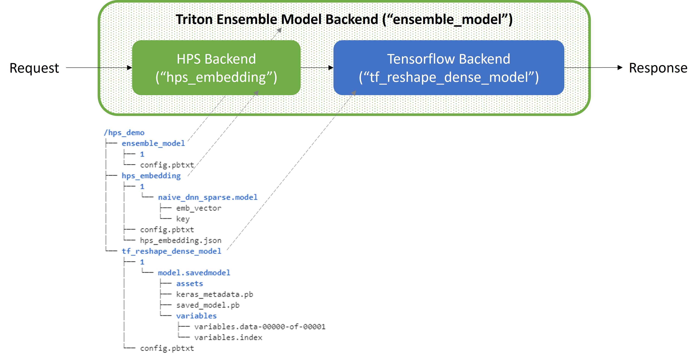
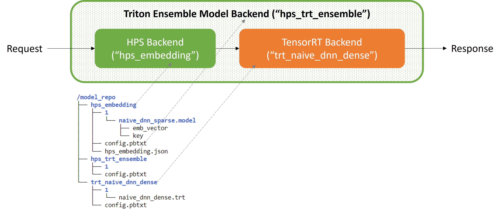

# Hierarchical parameter server (HPS) Triton ensemble model inference tutorial
Hierarchical Parameter Server (HPS) is a distributed recommendation inference framework, which combines a high-performance GPU embedding cache with an hierarchical storage architecture, to realize low-latency retrieval of embeddings for inference tasks. It is provided as a Python toolkit and can be easily integrated into the TensorFlow (TF) model graph.

This tutorial will show you how to integrate HPS backend and Tensorflow backend via Triton ensemble model, as shown in Fig. 1. By leveraging HPS, trained Tensorflow DNN models with large embedding tables can be efficiently deployed through the Triton Inference Server.

Furthermore, we demonstrate how to build the TensorRT engine the via TensorFlow->ONNX->TensorRT workflow, and how to deploy the ensemble model of HPS backend and TensorRT backend, as shown in Fig. 2.



<div align=center>Fig. 1: HPS and TensorFlow Triton Ensemble Model </div>

<br></br>




<div align=center>Fig. 2: HPS and TensorRT Triton Ensemble Model </div>

<br></br>

The example notebooks cover the following tasks:
* Model training ([01_model_training.ipynb](01_model_training.ipynb))
  * Generate mock datasets that meet the HPS input format
  * Train native Tensorflow DNN model
  * Separate the trained DNN model graph into two, embedding lookup and dense model graph
  * Reconstruct the dense model graph
  * Construct HPS lookup model, get DNN model weights and transfer to HPS
<<<<<<< HEAD
  * Convert the dense TF SavedModel to ONNX
* Model inference with HPS and TensorFlow ensemble ([02_model_inference_hps_tf_ensemble.ipynb](02_model_inference_hps_tf_ensemble.ipynb))
* Model inference with HPS and TensorRT ensemble ([03_model_inference_hps_trt_ensemble.ipynb](03_model_inference_hps_trt_ensemble.ipynb))
=======
* Model inference ([02_model_inference.ipynb](02_model_inference.ipynb))
  * Configure three backends in Triton format
  * Deploy to inference with Triton ensemble mode
  * Validate deployed ensemble model with dummy dataset

>>>>>>> 8fe3b4a23384c268bd4cd7ba738cb7062b91ed77

## Getting Started
The easiest way to test our code is through docker container. You can download latest docker image from NVIDIA GPU Cloud ([NGC](https://catalog.ngc.nvidia.com/containers?filters=&orderBy=dateModifiedDESC&query=merlin)). If you prefer to build your own HPS backend, refer to [Set Up the Development Environment With Merlin Containers](https://nvidia-merlin.github.io/HugeCTR/master/hugectr_contributor_guide.html#set-up-the-development-environment-with-merlin-containers) and [Build the HPS Backend from Scratch](../../README.md#hierarchical-parameter-server-backend).

<<<<<<< HEAD

### Pull the NGC Docker

Pull the container using the following command:

```shell
docker pull nvcr.io/nvidia/merlin/merlin-hugectr:22.11
```

### Clone the HugeCTR Backend Repository

Use the following command to clone the HugeCTR Backend repository:

```shell
git clone https://github.com/triton-inference-server/hugectr_backend.git
```

### Start the Jupyter Notebook
1. Launch the container in interactive mode (mount the HugeCTR Backend root directory into the container for your convenience) by running this command:

   ```shell
   docker run --runtime=nvidia --rm -it --cap-add SYS_NICE --gpus=all --net=host -u root -v $(pwd):/hugectr_backend -w /hugectr_backend nvcr.io/nvidia/merlin/merlin-hugectr:22.11 bash
   ```

2. Install the required modules to run the notebooks:
    ```shell
    pip install -r requirements.txt
    ```

3. Start Jupyter using these commands: 

   ```shell
   cd /hugectr_backend/hps_backend/samples/hps-triton-ensemble
   jupyter-notebook --allow-root --ip 0.0.0.0 --port 8888 --NotebookApp.token='hugectr'
   ```

4. Connect to your host machine using the 8888 port by accessing its IP address or name from your web browser: `http://[host machine]:8888`

   Use the token available from the output by running the command above to log in. For example:

   `http://[host machine]:8888/?token=aae96ae9387cd28151868fee318c3b3581a2d794f3b25c6b`


5. Run [01_model_training.ipynb](01_model_training.ipynb)


6. Launch another container to build the TensorRT engine from the ONNX model:
   ```shell
   docker run --runtime=nvidia --rm -it --cap-add SYS_NICE --gpus=all --net=host -u root -v $(pwd):/hugectr_backend -w /hugectr_backend nvcr.io/nvidia/merlin/tensorrt:22.11 bash
   ```
  
   ```shell
   cd /hugectr_backend/hps_backend/samples/hps-triton-ensemble
   trtexec --onnx=naive_dnn_dense.onnx --saveEngine=naive_dnn_dense.trt
   ```
   6.1 If you need to deploy the pytorch-related models, such as [HPS_Pytorch_ensemble_deployment.ipynb](HPS_Pytorch_ensemble_deployment.ipynb), then you need to first build the library of the  [Triton python backend](https://github.com/triton-inference-server/python_backend), and you can also copy it directly through the following command:
  
   ```
   docker run -v $(pwd):/hugectr_backend  nvcr.io/nvidia/tritonserver:22.08-py3 bash -cx "cp -r /opt/tritonserver/backends/pytorch /hugectr_backend/ "
   ```

   Next, you can directly copy the pytorch folder under ```/hugectr_backend/``` in the launched merlin container (step 1) to ```/opt/tritonserver/backends/```:
   ```
   cp -r /hugectr_backend/pytorch /opt/tritonserver/backends/
   ```


7. Continue running [02_model_inference_hps_tf_ensemble.ipynb](02_model_inference_hps_tf_ensemble.ipynb) and [03_model_inference_hps_trt_ensemble.ipynb](03_model_inference_hps_trt_ensemble.ipynb) in the previously launched `nvcr.io/nvidia/merlin/merlin-hugectr:22.11` container
=======
This tutorial is derived from the following notebooks, for more references, please check [Hierarchical Parameter Server Notebooks](https://github.com/NVIDIA-Merlin/HugeCTR/tree/master/hierarchical_parameter_server/notebooks).
>>>>>>> 8fe3b4a23384c268bd4cd7ba738cb7062b91ed77
